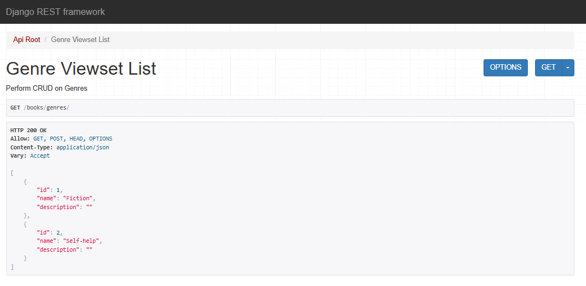

# BookClub API
[](https://github.com/Kiprotich-Code/bookclub_api/actions)
[](https://codecov.io/gh/Kiprotich-Code/bookclub_api)
[](LICENSE)
[](https://www.python.org/)



Welcome to the **BookClub API**! This project provides a robust backend for managing book clubs, members, books, and discussions. Built with Django REST Framework.

---

## 🚀 Features

- **User Authentication**: Secure registration, login, and profile management.
- **Book Clubs**: Create, join, and manage book clubs.
- **Books**: Add, update, and browse books.
- **Discussions**: Start and participate in club discussions.
- **Permissions**: Fine-grained access control for users and admins.
- **RESTful API**: Clean, well-documented endpoints.

---

## 🛠️ Tech Stack

- **Python 3**
- **Django 4**
- **Django REST Framework**
- **PostgreSQL** (default, configurable)
- **Docker** (optional)

---

## 📦 Installation

1. **Clone the repository**
    ```bash
    git clone https://github.com/Kiprotich-Code/bookclub_api.git
    cd bookclub_api
    ```

2. **Create a virtual environment**
    ```bash
    python3 -m venv venv
    source venv/bin/activate
    ```

3. **Install dependencies**
    ```bash
    pip install -r requirements.txt
    ```

4. **Configure environment variables**

    Copy `.env.example` to `.env` and update as needed.

5. **Apply migrations**
    ```bash
    python manage.py migrate
    ```

6. **Run the development server**
    ```bash
    python manage.py runserver
    ```

---

## 🧪 Running Tests

```bash
python manage.py test
```

---

## 📖 API Documentation

Interactive API docs available at:  
`http://localhost:8000/api/docs/` (work in progress)

---

## 🤝 Contributing

1. Fork the repo
2. Create your feature branch (`git checkout -b feature/YourFeature`)
3. Commit your changes (`git commit -am 'Add new feature'`)
4. Push to the branch (`git push origin feature/YourFeature`)
5. Open a Pull Request

---

## 📄 License

This project is licensed under the [MIT License](LICENSE).

---

## 🙏 Acknowledgements

- [Django REST Framework](https://www.django-rest-framework.org/)
- [PostgreSQL](https://www.postgresql.org/)
- All contributors!

---

Happy reading! 📚✨